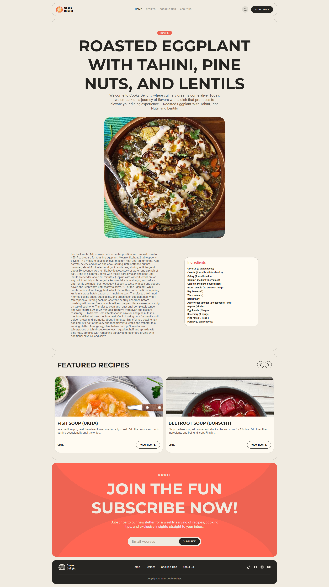

<h1 align="center">
  Cooks Delight
</h1>

O **Cooks Delight** é uma aplicação React que permite aos usuários explorar, filtrar e visualizar receitas de diversas categorias com navegação suave entre seções, busca dinâmica integrada e páginas de detalhes completas para cada prato.

<p align="center">
  
</p>


## 💻 Visão Geral

**Cooks Delight** é uma aplicação React moderna e responsiva que exibe uma coleção selecionada de receitas, com navegação suave dentro da página, obtenção dinâmica de dados e interface polida construída completamente com Styled Components. Entre seus principais diferenciais estão:

- Estrutura modular por containers (Hero, Explore, Featured, Recipes, About Us) para uma clara separação de responsabilidades.

- Roteamento cliente com React Router v6, incluindo links comuns e HashLinks para navegação suave entre seções.

- Gerenciamento de estado global utilizando Redux Toolkit e RTK Query para:

• Buscar receitas “latest”, “random”, por categoria, por ID ou por pesquisa diretamente na TheMealDB API.<br/>
• Controlar visibilidade de elementos de UI (menu mobile, SearchBox) e rastrear a seção ativa para efeito de scroll‑spy.
<br/>
- Styled Components para theming, estilos globais (via .editorconfig e configs de Prettier/ESLint) e componentes individuais (Button, Paragraph, Title, Tag, RecipeCard etc.).
<br/>
A aplicação utiliza o **Redux Toolkit** com **RTK Query** para gerenciamento de estado global e requisições à API de forma eficiente, aproveitando cache integrado e geração automática de hooks para componentes, e adota Styled Components (CSS‑in‑JS) para estilização modular e responsiva, garantindo que cada componente carregue apenas seus próprios estilos

## 🥗 Recipe

A página de receita permite aos usuários visualizar todos os detalhes de um prato — incluindo título, imagem em alta resolução, instruções passo a passo, lista dinâmica de ingredientes com medidas — e ainda navegar suavemente pelas seções relacionadas.

<p align="center">
  
</p>


## 🔗 Protótipo de Design

O layout e estilo deste projeto foram inspirados no template “FREE Cooking & Recipes Blog Template” disponível na Figma Community, que fornece estruturas de seções como página inicial, detalhes de receita, lista e post de blog, além de padrões de tipografia e paleta de cores Figma.

Para mais detalhes e acesso ao arquivo, visite:

-**Figma Community: FREE Cooking & Recipes Blog Template:** [Figma Design](https://www.figma.com/design/IuCD6iIodn4PAwDZuI0weD/-FREE--Cooking---Recipes-Blog-Template--Community-?node-id=7-360&t=egRikdgcVrBSbdll-0)

## ⚙️ Funcionalidades

- **Scroll‑spy no header:**  implementado via Intersection Observer API, que observa a visibilidade de cada seção e atualiza o hash da URL conforme o usuário rola a página.
- **Filtragem de receitas por categoria:** alimentada por chamadas RTK Query do Redux Toolkit, permitindo que o usuário selecione categorias (All, Vegan, Breakfast, Starter, Dessert etc.) e veja somente as receitas correspondentes.
- **Busca em tempo real:** com o endpoint getRecipeSearch, exibindo resultados dinamicamente em um modal controlado por Redux para abrir/fechar.
- **Página de detalhes da receita:** que consome o endpoint getRecipesID, exibindo título, imagem, instruções e lista dinâmica de ingredientes e medidas.
- **Gerenciamento global de estado:** com **Redux Toolkit** e **RTK Query**, aproveitando cache integrado e geração automática de hooks para requisições eficientes

## 📚  Tecnologias

Aqui estão as principais tecnologias utilizadas neste projeto:

- **React:** Biblioteca JavaScript para construção de interfaces de usuário baseadas em componentes, que atualiza eficientemente a DOM conforme os dados mudam.
- **React Router:** Solução de roteamento declarativo para aplicações React, permitindo naveção entre páginas e suporte a HashLinks para âncoras.
- **Redux Toolkit:** Conjunto de ferramentas opinativo que simplifica a configuração do Redux, cria reducers mais facilmente e já inclui boas práticas por padrão.
- **RTK Query:** Módulo de data fetching e caching integrado ao Redux Toolkit, que gera hooks automaticamente e gerencia cache de forma eficiente.
- **Styled Components:** Biblioteca CSS‑in‑JS que permite escrever CSS diretamente em JavaScript, vinculando estilos ao ciclo de vida dos componentes.

## 🛠️ Instalação

### Requisitos

- Node.js (versão 20 ou superior)
- npm (versão 8 ou superior)

### Passos

1. **Clone o repositório:**

```sh
git clone https://github.com/RodrigoRodrigues-Dev/Cooks-Delight.git

cd Cooks-Delight
```

2. **Instale as dependências:**

```sh
npm install
```
<br>

## 📃 Licença
Este projeto está licenciado sob a Licença MIT - veja o arquivo [LICENSE](LICENSE) para mais detalhes.
<br>


## ☎️ Contato
Desenvolvido por [Rodrigo Rodrigues](https://github.com/RodrigoRodrigues-Dev). Entre em contato por 📧 [rodrigorodriguesdevcontato@gmail.com](mailto:rodrigorodriguesdevcontato@gmail.com)
